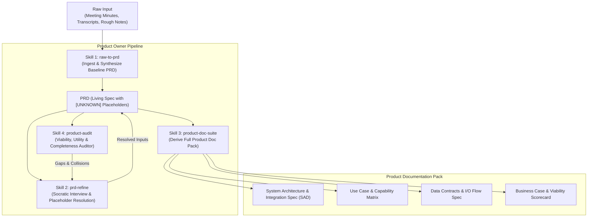
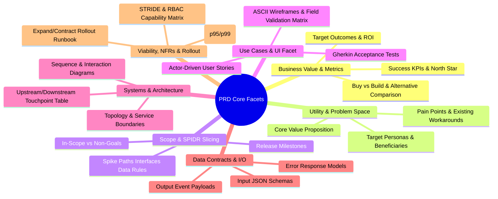

# Specification: Product Owner Skill Suite (Meeting/Raw-to-PRD Engine)

## 1. Executive Summary & Vision

The **Product Owner Skill Suite** is a modular collection of Antigravity agent skills designed to ingest raw, unstructured meeting minutes, interview transcripts, and rough product notes (including upstream output from notes/transcription skills like `/meeting-notes`), and systematically synthesize them into a production-grade **Product Requirements Document (PRD)** and comprehensive companion **Product Documentation Suite**.

A core tenet of this system is **Grounding Over Hallucination**:
- **Zero Fabrication**: If a detail (e.g., specific auth protocol, database technology, SLA threshold) is not mentioned or deducible from raw input, the system **never** invents it.
- **Explicit Placeholders**: Ambiguities, missing data, and unmade architectural decisions are captured as structured `[UNKNOWN: ...]` and `[DECISION NEEDED: ...]` markers.
- **Iterative Socratic Grounds**: Placeholders serve as actionable prompts and interview agendas for follow-up refinement cycles.

---

## 2. System Architecture & Capability Map



### Module Breakdown

| Module ID | Skill Name | Responsibility | Primary Inputs | Primary Outputs |
|---|---|---|---|---|
| `raw-to-prd` | Raw-to-PRD Synthesizer | Parses raw meeting notes/transcripts, extracts 7 core facets + UI wireframes, NFRs, RBAC & SPIDR slicing, builds structured baseline PRD with `[UNKNOWN]` markers and Mermaid diagrams. | Meeting notes, transcripts, brainstorm text | `PRD.md` |
| `prd-refine` | PRD Socratic Refiner | Drives targeted one-question-at-a-time interviews on unresolved `[UNKNOWN]` and `[DECISION NEEDED]` blocks to achieve spec completeness. | `PRD.md`, user feedback | Updated `PRD.md` |
| `product-doc-suite` | Product Doc Pack Generator | Generates auxiliary technical and operational documentation (SAD with STRIDE, Use Cases with Wireframes & SPIDR, Contracts with RBAC, Viability with SLOs & Rollout Runbook) derived strictly from the finalized PRD. | `PRD.md` | `docs/architecture.md`, `docs/use-cases.md`, `docs/contracts.md`, `docs/viability.md` |
| `product-audit` | Product Viability & Quality Gate | Audits PRD and docs across 7 quality gates: Section Completeness, Diagram Parity, Contract Pairing, NFR Budgeting, RBAC Security, SPIDR Slicing, and Zero-Hallucination. | `PRD.md`, `docs/` | `AUDIT-PRD.md` (Pass/Fail + gap list) |

---

## 3. Core Facets & Extended Analysis Dimensions

Every generated PRD must evaluate, capture, and structure the following 7 dimensions:



1. **Problem Space & Utility**:
   - Precise definition of personas, pain points, core value proposition, and structured **Alternative & Workaround Comparison** (Buy vs. Build).
2. **Business Value & Success Metrics**:
   - Measurable KPIs (e.g., latency reduction, CAC reduction, conversion uplift, workflow automation hours saved), ROI calculation, and strategic priorities.
3. **Scope & SPIDR MVP Slicing**:
   - Scope boundaries and structured **SPIDR Decomposition** (Spike, Paths, Interfaces, Data, Rules) defining Phase 1 MVP vs. Phase 2+ increments.
4. **Use Cases & UI/UX Interaction Facet**:
   - Actor personas, preconditions, trigger events, step-by-step happy path, edge cases, **ASCII Wireframe Layouts**, and **Field-Level Validation Matrix**.
5. **Technologies Involved & Systems Touched**:
   - Explicit inventory of systems: internal databases, microservices, 3rd party APIs, legacy components touched, auth providers, messaging buses, and Mermaid topologies.
6. **Data Contracts & I/O Specifications**:
   - Input ingestion formats (REST, gRPC, webhooks, files), output formats, schema definitions, error payloads, and state persistence rules.
7. **Viability, NFRs, Security & Safe Rollout**:
   - **Quantitative NFRs & Latency SLO/SLA Targets** (p50/p95/p99, throughput, RTO/RPO).
   - **STRIDE Threat Modeling & RBAC Capability Matrix**.
   - **Zero-Downtime Rollout & Feature Flagging Runbook** (Expand/contract DB pattern, rollback triggers).

---

## 4. Grounding, Placeholders & Anti-Hallucination Engine

### The Strict Unknown Policy
When input text lacks conclusive facts for a section, the skill **must never guess or assume standard industry defaults silently**. Instead, it emits a standardized, actionable placeholder block:

```markdown
> [!NOTE] UNRESOLVED ITEM
> **[UNKNOWN: <Topic / Open Question>]**
> - **Source Context**: *<What raw note triggered this question or why it was needed>*
> - **Options Identified**: *<Possible alternatives if mentioned in meeting, or left blank>*
> - **Impact**: *<What architectural or product decision is blocked until answered>*
> - **Interview Prompt**: *"<Direct question to ask stakeholder in next refinement loop>"*
```

### Placeholder Taxonomy
- `[UNKNOWN: REQUIREMENT]` — Missing functional criteria or business rules.
- `[UNKNOWN: ARCHITECTURE]` — Unspecified tech stack, integration protocols, or service ownership.
- `[UNKNOWN: DATA_SCHEMA]` — Unclear field types, validation constraints, or payload schemas.
- `[UNKNOWN: NFR_METRIC]` — Missing numerical targets, latency limits, throughput, or KPI baselines.
- `[UNKNOWN: SECURITY_RBAC]` — Unspecified permission tiers, auth flows, or data classification.
- `[DECISION NEEDED: FORK]` — Multiple conflicting suggestions surfaced in notes with no decision recorded.

---

## 5. Specification of Individual Skills

### Skill 1: `raw-to-prd`
- **Trigger**: `/raw-to-prd` or passing meeting notes / minutes / transcripts to the agent.
- **Behaviors**:
  1. Parse input text into raw statements, decisions, open debates, action items, UI screen notes, NFRs, and technical references.
  2. Map raw evidence directly into the 7 core PRD dimensions.
  3. Tag every ungrounded requirement with the standard `[UNKNOWN: ...]` placeholder block.
  4. Generate Mermaid diagrams representing the discussed system interactions and user workflows.
  5. Output the living document to `PRD.md` at the workspace root or designated folder.

### Skill 2: `prd-refine`
- **Trigger**: `/prd-refine` or when user requests resolving open questions on an existing PRD.
- **Behaviors**:
  1. Scan `PRD.md` for all active `[UNKNOWN: ...]` and `[DECISION NEEDED: ...]` markers.
  2. Order unknowns by architectural impact and dependency priority.
  3. Run an interactive Socratic interview loop (1 to 2 focused questions at a time).
  4. Upon receiving stakeholder input, replace the placeholder with the confirmed requirement and update dependent sections/diagrams in-place.
  5. Track version history and log decisions in an "Audit Trail & Decision Log" section at the end of `PRD.md`.

### Skill 3: `product-doc-suite`
- **Trigger**: `/product-doc-suite` or after `PRD.md` reaches a baseline threshold of resolved placeholders.
- **Behaviors**:
  - Automatically generates or updates modular companion documents in `docs/`:
    1. `docs/architecture.md` (System Architecture Document / SAD) - In-depth system interactions, sequence flows, failure zones, infra boundaries, STRIDE threat model.
    2. `docs/use-cases.md` (Comprehensive User Stories & Edge Case Matrix) - Gherkin scenarios (Given/When/Then), persona profiles, ASCII wireframes, SPIDR vertical MVP slicing.
    3. `docs/contracts.md` (I/O & Data Interface Spec) - JSON schemas, webhook event models, REST/gRPC endpoint tables, RBAC capability matrices.
    4. `docs/viability.md` (Business Case & Viability Scorecard) - ROI projections, risk assessment, latency SLO budgets, zero-downtime expand/contract runbook.

### Skill 4: `product-audit`
- **Trigger**: `/product-audit` or pre-development validation gate.
- **Behaviors**:
  1. Computes the **Spec Completeness Index (SCI)** (% of required sections free of `[UNKNOWN]` markers).
  2. Evaluates against 7 verification gates: Section completeness, Diagram parity, Contract pairing, NFR budgeting, Threat/RBAC security, SPIDR slicing, and Zero-hallucination.
  3. Emits `AUDIT-PRD.md` with Pass/Warning/Fail status and remediation actions.

---

## 6. Document Templates & Schemas

### Canonical `PRD.md` Schema
```markdown
# PRD: [Product / Feature Name]

## 1. Executive Summary & Problem Space
- **Problem Statement**: ...
- **Target Audience / Beneficiaries**: ...
- **Core Value Proposition**: ...
- **Alternative & Workaround Comparison**: ...

## 2. Business Value & Success Metrics
- **Strategic Objectives**: ...
- **Success Metrics (KPIs)**: ...
- **Target Timeline & Milestones**: ...

## 3. Scope, Capability Map & SPIDR MVP Slicing
### 3.1 Scope Boundaries (In-Scope vs. Non-Goals)
### 3.2 SPIDR Vertical MVP Slicing (Spike, Paths, Interfaces, Data, Rules)

## 4. Detailed Use Cases, User Journeys & UI/UX Specifications
### 4.1 Detailed Use Cases (Gherkin & Edge Cases)
### 4.2 UI/UX Wireframe & Interaction Layouts
- ASCII Screen Mockup
- Form & Field Validation Matrix
- Component State Transitions

## 5. System Interactions & Architecture
### 5.1 Architecture Topology (Mermaid flowchart)
### 5.2 Systems Interacted With & Touched
### 5.3 Sequence & Integration Flows (Mermaid sequenceDiagram)

## 6. Data Contracts & I/O Specifications
### 6.1 Input Ingestion Contracts (JSON Schema)
### 6.2 Output & Event Contracts (Event Schema & Error Models)

## 7. Viability, NFRs, Security & Safe Rollout
### 7.1 Quantitative NFRs & Latency SLO/SLA Targets
### 7.2 Security Threat Model (STRIDE) & RBAC Capability Matrix
### 7.3 Zero-Downtime Rollout & Feature Flagging Runbook
### 7.4 Risk Assessment & Mitigation Matrix

## 8. Open Questions & Placeholder Registry
*(Auto-populated with all unresolved `[UNKNOWN]` markers)*

## 9. Decision Log & Audit Trail
| Date | Section Affected | Prior State / Question | Decision Made | Stakeholder / Source |
|---|---|---|---|---|
```

---

## 7. Verification Matrix & Acceptance Criteria

| ID | Requirement | Verification Method | Acceptance Threshold |
|---|---|---|---|
| **V1** | Input Ingestion Flexibility | Feed raw unformatted notes, bulleted minutes, transcripts, and upstream `/meeting-notes` format. | 100% successful parse into structured sections. |
| **V2** | Strict Zero-Hallucination | Inject notes with intentionally omitted tech stacks and data models. | Zero fabricated technologies; emits formatted `[UNKNOWN]` placeholders. |
| **V3** | 7-Facet & Extended Coverage | Generate PRD from complete transcript. | PRD contains all 7 core facets + UI wireframe, NFR, RBAC, and SPIDR slicing. |
| **V4** | Valid Mermaid Generation | Render generated diagrams using standard Mermaid parser. | Syntax valid on `flowchart`, `sequenceDiagram`, `stateDiagram-v2`. |
| **V5** | Socratic Refinement Cycle | Run `prd-refine` on PRD with 5 placeholders. | Successfully interviews user, replaces placeholders with facts, updates decision log. |
| **V6** | Complete Doc Pack Generation | Run `product-doc-suite` on approved PRD. | Generates enriched `architecture.md`, `use-cases.md`, `contracts.md`, and `viability.md` in `docs/`. |
| **V7** | 7-Gate Quality Audit | Run `product-audit` on frozen PRD. | Validates SCI score, NFR budgets, STRIDE/RBAC, and rollout runbook in `AUDIT-PRD.md`. |
