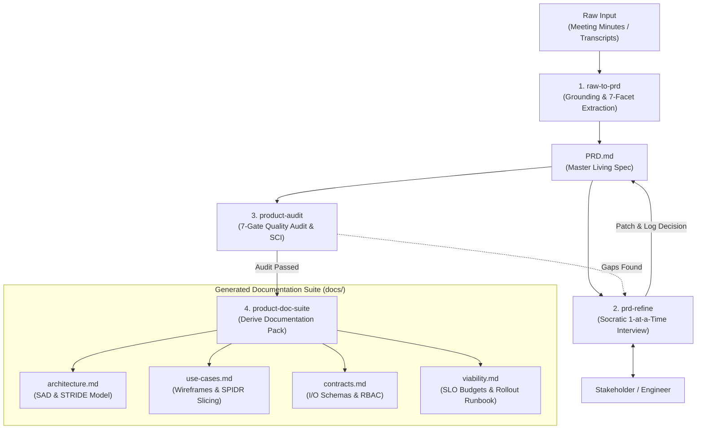

# Product Owner Skill Suite Documentation

Welcome to the documentation suite for the **Product Owner Skill Suite (Raw-to-PRD & Product Documentation Engine)**.

This system bridges the gap between messy, unstructured meeting minutes, interview transcripts, or raw notes and production-grade, actionable product specifications and documentation packs.

---

## Documentation Index

| Document | Description | Key Contents |
|---|---|---|
| [System Architecture](file:///home/bill/src/ai/product-owner/docs/architecture.md) | Full architectural blueprint of the skill pipeline and engine | Component topology, 7-facet engine, STRIDE threat model, SPIDR build order, Expand/Contract DB pattern |
| [System Interactions](file:///home/bill/src/ai/product-owner/docs/interactions.md) | Interaction protocols between users, agents, and upstream systems | Socratic interview protocol, multi-system integration touchpoints, sequence flows |
| [Use Cases & Wireframes](file:///home/bill/src/ai/product-owner/docs/use-cases.md) | Actor journeys, functional requirements, and UI/UX wireframe specs | ASCII wireframe layouts, field validation matrix, component state machine, SPIDR MVP slicing, Gherkin specs |
| [Data Contracts & Schemas](file:///home/bill/src/ai/product-owner/docs/contracts.md) | Exact schema definitions for PRD, placeholder syntax, and derived documents | `PRD.md` format, `[UNKNOWN]` taxonomy, RBAC schema, Feature Flag schema, JSON payload models |
| [Viability & Quality Gate](file:///home/bill/src/ai/product-owner/docs/viability.md) | Quality gates, Spec Completeness Index (SCI), and operational rollout runbook | Quantitative latency SLO budgets, zero-downtime rollout phases, automated rollback triggers, 7-gate audit rubric |
| [Diagram Library](file:///home/bill/src/ai/product-owner/docs/diagrams/) | Standalone `.mmd` diagram files | Architecture, sequence, data flow, state lifecycle, system boundaries |

---

## System Architecture at a Glance

### ASCII Architecture Overview

```text
+-----------------------------------------------------------------------------------+
|                                  INPUT SOURCES                                    |
|   +-------------------+   +--------------------+   +--------------------------+   |
|   | Raw Meeting Notes |   | Audio Transcripts  |   | /meeting-notes Output    |   |
|   +---------+---------+   +---------+----------+   +------------+-------------+   |
+-------------|-----------------------|---------------------------|-----------------+
              |                       |                           |
              +-----------------------v---------------------------+
                                      |
+-------------------------------------v---------------------------------------------+
|                         PRODUCT OWNER PIPELINE ENGINE                             |
|                                                                                   |
|  +-----------------------------------------------------------------------------+  |
|  | [1] raw-to-prd: 7-Facet Analysis, UI Wireframes & NFR Grounding             |  |
|  | - Extracts explicit facts                                                   |  |
|  | - Generates ASCII wireframes, field matrices & SPIDR slices                 |  |
|  | - Flags gaps as [UNKNOWN: ...] / [DECISION NEEDED: ...]                     |  |
|  | - Generates Mermaid architecture & sequence diagrams                       |  |
|  +-------------------------------------+---------------------------------------+  |
|                                        | emits baseline                           |
|                                        v                                          |
|  +-----------------------------------------------------------------------------+  |
|  | [2] Living PRD: Master Contract (PRD.md)                                    |  |
|  | - Living source of truth with embedded placeholder registry & audit trail   |  |
|  +-------------------------------------+---------------------------------------+  |
|                                        | feeds into                               |
|                                        v                                          |
|  +-----------------------------------------------------------------------------+  |
|  | [3] prd-refine: Socratic Interactive Refinement Loop                        |  |
|  | - Prioritizes unknowns -> Asks 1 targeted question at a time                |  |
|  | - Patches PRD.md in-place -> Records decision in audit log                  |  |
|  +-------------------------------------+---------------------------------------+  |
|                                        | freezes when SCI = 100%                  |
|                                        v                                          |
|  +-----------------------------------------------------------------------------+  |
|  | [4] product-audit: 7-Gate Quality Validation                                |  |
|  | - Evaluates SCI, NFR budgets, STRIDE/RBAC, and diagram consistency          |  |
|  +-------------------------------------+---------------------------------------+  |
|                                        | emits AUDIT-PRD.md (PASS)                |
|                                        v                                          |
|  +-----------------------------------------------------------------------------+  |
|  | [5] product-doc-suite: Derived Product Documentation Pack                   |  |
|  | - docs/architecture.md  - docs/use-cases.md                                 |  |
|  | - docs/contracts.md     - docs/viability.md                                 |  |
|  +-----------------------------------------------------------------------------+  |
+-----------------------------------------------------------------------------------+
```

### Inline Mermaid Architecture



---

## Core Guiding Principles

1. **Grounding Over Hallucination**: No technical stack, data model, or business SLA is invented without explicit evidence in raw notes.
2. **Actionable Placeholders**: All missing details are formatted as structured `[UNKNOWN: ...]` markers that double as interview prompts.
3. **Progressive Refinement**: A PRD is not a static one-off dump; it matures through iterative Socratic dialogue until reaching 100% Spec Completeness.
4. **Synchronized Documentation**: Downstream architectural, interface, and viability specifications are strictly derived from the approved PRD.
