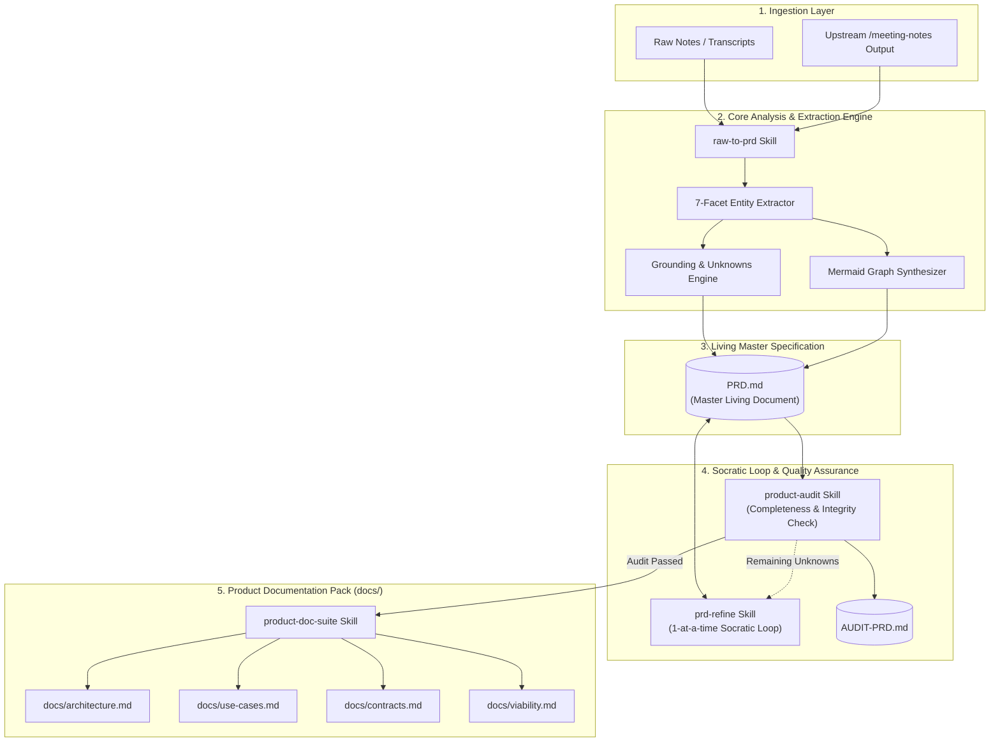
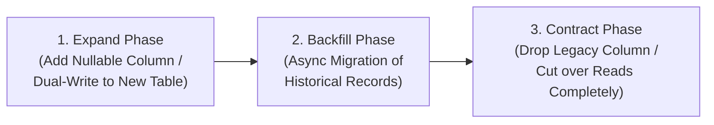
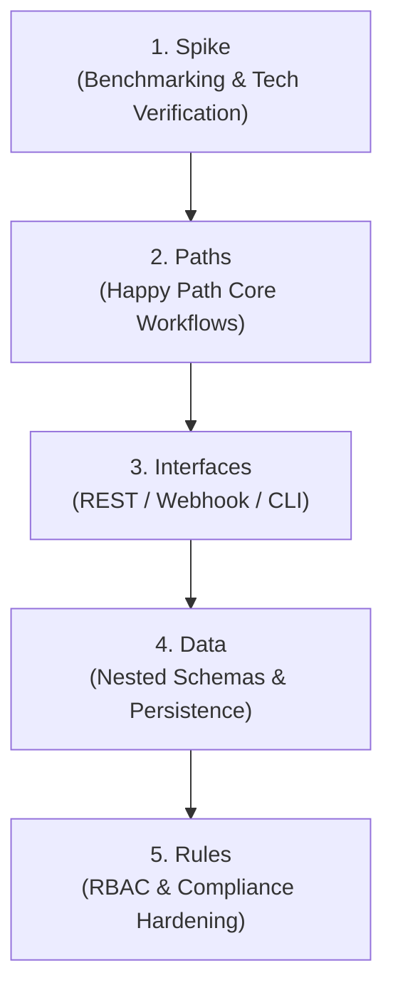

# System Architecture Document (SAD): Product Owner Skill Suite

## 1. Architectural Overview

The **Product Owner Skill Suite** provides an automated, deterministic pipeline that transforms unstructured product discussions, meeting minutes, and audio transcripts into a formal **Product Requirements Document (PRD)** and comprehensive **Product Documentation Suite**.

The architecture adheres to three core architectural invariants:
1. **Strict Evidence Grounding**: Deductions must be strictly backed by input text. Missing details trigger standardized placeholders instead of ungrounded completions.
2. **Deterministic State Lifecycle**: The PRD is treated as an immutable state machine where `[UNKNOWN]` markers are systematically converted into resolved decisions with timestamped audit trails.
3. **Derived Coherence**: Technical specifications, interface contracts, and viability models are generated deterministically from the approved PRD to prevent specification drift.

---

## 2. Architecture Diagrams

### 2.1 ASCII System Topology

```text
+===================================================================================================+
|                                    PRODUCT OWNER ARCHITECTURE                                     |
+===================================================================================================+
|                                                                                                   |
|  [ LAYER 1: INTAKE & PARSING ]                                                                    |
|  +---------------------+      +------------------------+      +--------------------------------+  |
|  | Unstructured Notes  |  OR  | Meeting Minutes (.txt) |  OR  | Upstream /meeting-notes Skill  |  |
|  +----------+----------+      +-----------+------------+      +---------------+----------------+  |
|             \                             |                                  /                    |
|              \--------------------------->+<--------------------------------/                     |
|                                           |                                                       |
|                                           v                                                       |
|  [ LAYER 2: 7-FACET SYNTHESIS & GROUNDING (raw-to-prd) ]                                          |
|  +---------------------------------------------------------------------------------------------+  |
|  |  +-----------------------+   +------------------------+   +------------------------------+  |  |
|  |  | Fact & Evidence Match |   | Anti-Hallucination Gap |   | Mermaid Topology & Sequence  |  |  |
|  |  | (100% Text Grounding) |   | (Flags [UNKNOWN] Tags) |   | (Graph Visualizer Engine)    |  |  |
|  |  +-----------+-----------+   +-----------+------------+   +--------------+---------------+  |  |
|  +--------------|---------------------------|-------------------------------|------------------+  |
|                 \                           |                              /                      |
|                  \------------------------->+<----------------------------/                       |
|                                             |                                                     |
|                                             v                                                     |
|  [ LAYER 3: MASTER LIVING SPECIFICATION ]                                                         |
|  +---------------------------------------------------------------------------------------------+  |
|  | PRD.md                                                                                      |  |
|  |  - Sections 1-7: Core Facets (Utility, Business, Use Cases, Systems, I/O, Viability)        |  |
|  |  - Section 8:    Active Placeholder Registry                                                |  |
|  |  - Section 9:    Decision Log & Audit Trail                                                 |  |
|  +------------------------------------------+--------------------------------------------------+  |
|                                             |                                                     |
|                     +-----------------------+-----------------------+                             |
|                     |                                               |                             |
|                     v                                               v                             |
|  [ LAYER 4: SOCRATIC REFINEMENT (prd-refine) ]     [ LAYER 5: QUALITY GATE (product-audit) ]      |
|  +-------------------------------------------+     +-------------------------------------------+  |
|  | - Scans active [UNKNOWN] markers          |     | - Calculates Spec Completeness Index (SCI)|  |
|  | - Prioritizes highest architectural risk  |     | - Validates Mermaid nodes vs text systems |  |
|  | - Executes 1-at-a-time interactive interview |  | - Checks I/O schema completeness          |  |
|  | - Patches PRD.md in-place                 |     | - Emits AUDIT-PRD.md                      |  |
|  +-------------------------------------------+     +---------------------+---------------------+  |
|                     ^                                                    |                        |
|                     |================ (If Audit Fails) ==================| (If Audit Passes)      |
|                                                                          |                        |
|                                                                          v                        |
|  [ LAYER 6: MULTI-SPECIFICATION SUITE GENERATOR (product-doc-suite) ]                             |
|  +---------------------------------------------------------------------------------------------+  |
|  |  +--------------------+   +-------------------+   +--------------------+   +-------------+  |  |
|  |  | docs/architecture.md|   | docs/use-cases.md |   | docs/contracts.md  |   |docs/viability|  |  |
|  |  | (Detailed SAD Spec)|   | (Gherkin Scenarios|   | (I/O JSON Schemas) |   | (ROI & Risk)|  |  |
|  |  +--------------------+   +-------------------+   +--------------------+   +-------------+  |  |
|  +---------------------------------------------------------------------------------------------+  |
+===================================================================================================+
```

### 2.2 Inline Mermaid System Architecture



*Standalone Diagram Source:* [system-architecture.mmd](file:///home/bill/src/ai/product-owner/docs/diagrams/system-architecture.mmd)

---

## 3. Threat Modeling & Security Architecture (STRIDE)

Every system interaction captured in the PRD is cross-referenced against the STRIDE threat matrix:

```text
+-------------------+---------------------------------------------------+-----------------------------------------+
| STRIDE Category   | Primary Threat Vector                             | Required Architectural Mitigation       |
+-------------------+---------------------------------------------------+-----------------------------------------+
| **Spoofing**      | Forged client identities / webhook masquerading   | mTLS, JWT signature verification        |
| **Tampering**     | Payload manipulation in transit or storage        | TLS 1.3, HMAC-SHA256 payload signing    |
| **Repudiation**   | Denying execution of an administrative action     | Append-only immutable audit log table   |
| **Information**   | Sensitive PII leakage in logs or responses        | Field-level masking & column encryption |
| **Denial of Serv**| API saturation / unthrottled ingestion bursts     | Redis token-bucket rate limiter         |
| **Elevation**     | Privilege escalation via missing authz checks     | Enforced RBAC middleware on all routes  |
+-------------------+---------------------------------------------------+-----------------------------------------+
```

---

## 4. Zero-Downtime Database Architecture (Expand / Contract)

To prevent downtime during schema migrations, the architecture enforces a three-phase transition pattern:



1. **Expand Phase**: Application code writes to both old and new schema structures; reads remain on old schema.
2. **Backfill Phase**: Background workers asynchronously migrate existing historical data into the new format.
3. **Contract Phase**: Application shifts reads to new schema; legacy columns and deprecated tables are dropped safely.

---

## 5. SPIDR Execution & Build Order

The architectural build order is governed by SPIDR dependency tiers:



---

## 6. Subsystem Detailed Specifications

### 6.1 Subsystem 1: Ingestion & 7-Facet Synthesizer (`raw-to-prd`)
- **Purpose**: Consumes raw input text and constructs an exhaustive first draft of `PRD.md`.
- **The 7-Facet Extraction Matrix**:
  1. **Utility & Problem Space**: Target personas, user pain points, and workaround comparisons.
  2. **Business Value & KPIs**: Quantifiable ROI targets, timeline milestones.
  3. **Scope & SPIDR Slicing**: Clear MVP boundaries decomposed across Spike, Paths, Interfaces, Data, and Rules.
  4. **Use Cases & UI Facet**: User journeys, Gherkin scenarios, ASCII screen wireframes, and field validation matrices.
  5. **Technologies & Systems Touched**: Internal databases, microservices, 3rd party APIs, and cloud topology.
  6. **Data Contracts & I/O**: Payload JSON schemas, output models, and error responses.
  7. **Viability, NFRs & Rollout**: Quantitative latency SLOs (p95/p99), STRIDE security, and zero-downtime runbooks.

### 6.2 Subsystem 2: Socratic Refinement Engine (`prd-refine`)
- **Purpose**: Systematically eliminates all `[UNKNOWN: ...]` and `[DECISION NEEDED: ...]` markers from `PRD.md`.
- **Execution Mechanism**:
  1. **Dependency Analysis**: Builds an internal dependency graph of open unknowns.
  2. **Atomic Socratic Querying**: Prompts the user with one question at a time with clear context and recommendations.
  3. **In-Place Mutation**: Directly patches `PRD.md` and appends to Section 9 (*Decision Log & Audit Trail*).

### 6.3 Subsystem 3: Quality Gate & Auditor (`product-audit`)
- **Purpose**: Acts as an automated quality gate before downstream engineering begins.
- **Verification Dimensions**: 7-gate validation (Completeness, Diagram parity, Contract pairing, NFR budgeting, RBAC security, SPIDR slicing, Zero-hallucination).

### 6.4 Subsystem 4: Product Documentation Suite (`product-doc-suite`)
- **Purpose**: Generates granular, modular engineering documents from the approved `PRD.md` (`docs/architecture.md`, `docs/use-cases.md`, `docs/contracts.md`, `docs/viability.md`).

---

## 7. State Management & Lifecycle

```text
[ RAW INTAKE ] ──> [ DRAFT (SCI < 60%) ] ──> [ REFINING (SCI 60-95%) ] ──> [ FROZEN (SCI 100%) ] ──> [ DERIVED DOCS ]
```

*Standalone State Lifecycle Source:* [state-lifecycle.mmd](file:///home/bill/src/ai/product-owner/docs/diagrams/state-lifecycle.mmd)
