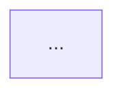

# Data Contracts & Schema Specifications

## 1. Placeholder & Unknown Syntax Contract

The Product Owner pipeline relies on a machine-parseable, human-readable placeholder contract to mark all ambiguities and unmade decisions.

### 1.1 Formal Placeholder Grammar

```text
> [!NOTE] UNRESOLVED ITEM
> **[UNKNOWN: <CATEGORY> - <TOPIC_TITLE>]**
> - **Source Context**: <Brief quote or note excerpt triggering the question>
> - **Options Identified**: <Option 1> | <Option 2> | <Option 3> (or None)
> - **Impact**: <Downstream sections or engineering tasks blocked>
> - **Interview Prompt**: "<Actionable Socratic question for refinement>"
```

### 1.2 Placeholder Taxonomy

| Category Key | Scope | Example |
|---|---|---|
| `REQUIREMENT` | Business logic, scope boundaries, user permissions | `[UNKNOWN: REQUIREMENT - Multi-Tenant Isolation Rule]` |
| `ARCHITECTURE` | Tech stack, cloud infra, message brokers, caching | `[UNKNOWN: ARCHITECTURE - Message Broker Selection]` |
| `DATA_SCHEMA` | Field types, primary keys, nullability, formats | `[UNKNOWN: DATA_SCHEMA - Transaction ID Format]` |
| `INTEGRATION` | External APIs, auth mechanisms, webhook retries | `[UNKNOWN: INTEGRATION - CRM Webhook Signature Auth]` |
| `METRIC` | Target latency, throughput, error budget, KPIs | `[UNKNOWN: METRIC - Ingestion Latency SLA Target]` |
| `DECISION NEEDED` | Conflicting options surfaced in meeting minutes | `[DECISION NEEDED: FORK - GraphQL vs REST API Standard]` |

---

## 2. Master `PRD.md` Document Schema Contract

Every generated `PRD.md` must strictly adhere to this 9-section structure:

```markdown
# PRD: [Product / Initiative Name]

## 1. Executive Summary & Problem Space
- **Problem Statement**: [Concrete description of pain points]
- **Target Beneficiaries**: [User personas and stakeholders]
- **Core Value Proposition**: [Delta over current solution]

## 2. Business Value & Success Metrics
- **Strategic Objectives**: [High-level business outcomes]
- **Primary KPIs**:
  | Metric Name | Baseline | Target Goal | Measurement Window |
  |---|---|---|---|
- **Target Timeline & Milestones**: [Target release phases]

## 3. Scope & Capability Map
- **In-Scope Capabilities**: [Explicit list of features]
- **Out-of-Scope / Non-Goals**: [Explicit anti-features and deferred items]
- **Phased Rollout Strategy**: [Phase 1 MVP -> Phase 2 -> Phase 3]

## 4. Detailed Use Cases & User Journeys
### UC-01: [Use Case Name]
- **Primary Actor**: [Persona]
- **Preconditions**: [State before trigger]
- **Trigger**: [Event initiating workflow]
- **Happy Path**: [Step-by-step sequence]
- **Edge Cases & Error Handling**: [Alternative branches]
- **Postconditions**: [State after completion]

## 5. System Interactions & Architecture
### 5.1 Architecture Topology

### 5.2 Systems Interacted With & Touched
| System Name | Category | Ownership | Protocol | Data Exchanged | Fallback Strategy |
|---|---|---|---|---|---|

### 5.3 Sequence & Integration Flows
```mermaid
sequenceDiagram
    ...
```

## 6. Data Contracts & I/O Specifications
### 6.1 Input Ingestion Contracts
- **Ingestion Channel**: [REST / gRPC / Webhook / File / CLI]
- **Input Payload Schema**:
```json
{
  "$schema": "https://json-schema.org/draft/2020-12/schema",
  "type": "object",
  "properties": {}
}
```

### 6.2 Output & Event Contracts
- **Output Schema**: [Response JSON / Event Payload]
- **Error Response Codes & Schemas**: [HTTP 400/404/500 models]

## 7. Viability, Risks & Technical Constraints
- **Technical Feasibility & Bottlenecks**: [Known limitations]
- **Dependencies**: [Internal services, vendor SLAs]
- **Security, Privacy & Compliance**: [GDPR, SOC2, Encryption]
- **Risk Assessment & Mitigation Matrix**:
  | Risk Description | Severity (H/M/L) | Likelihood (H/M/L) | Mitigation Strategy |
  |---|---|---|---|

## 8. Open Questions & Placeholder Registry
*(Auto-populated with all unresolved `[UNKNOWN]` markers)*

## 9. Decision Log & Audit Trail
| Date (ISO) | Section Affected | Prior State / Question | Decision Made | Author / Stakeholder |
|---|---|---|---|---|
```

---

## 3. Decision Log Table Contract (Section 9)

To ensure full accountability and traceability, all modifications to the PRD made during the Socratic refinement loop MUST append a record adhering to this schema:

```text
| Date (YYYY-MM-DD) | Section Affected | Prior State / Question | Decision Made | Author / Stakeholder |
```

### Example Entry
```markdown
| 2026-09-13 | Section 5.2 (Architecture) | [UNKNOWN: ARCHITECTURE - Message Broker] | Selected Apache Kafka for replayable event streaming | Lead Architect (@bill) |
```

---

## 4. Derived Documentation Suite Contract (`docs/`)

When `product-doc-suite` runs, it derives four standardized documents:

```text
docs/
├── architecture.md    # System Architecture Document (SAD), topologies, failure domains
├── use-cases.md       # Persona definitions, capability matrix, Gherkin specs
├── contracts.md       # API endpoints, JSON schemas, event payloads, error schemas
└── viability.md       # ROI analysis, business scorecard, compliance checklist
```

---

## 5. Quality Audit Schema (`AUDIT-PRD.md`)

```markdown
# Quality Gate Audit: [Product Name]

- **Audit Date**: [ISO Timestamp]
- **Overall Verdict**: [ PASS | WARNING | FAIL ]
- **Spec Completeness Index (SCI)**: [ 0% - 100% ]

## 1. Completeness Evaluation
- **Total Required Sections**: 9
- **Fully Specified Sections**: [Count]
- **Active Unknown Placeholders**: [Count]

## 2. Structural & Diagram Consistency
- [x] All Section 5.2 systems are rendered in Section 5.1 Mermaid diagram
- [x] All Section 6.1 inputs have matching Section 6.2 outputs
- [x] Section 8 Placeholder Registry matches all active inline tags

## 3. Anti-Hallucination & Grounding Check
- [x] Zero ungrounded architectural choices detected
- [x] All requirements traceable to meeting notes or Decision Log

## 4. Remediation Items (If Verdict != PASS)
1. [Required action to reach PASS status]
```
