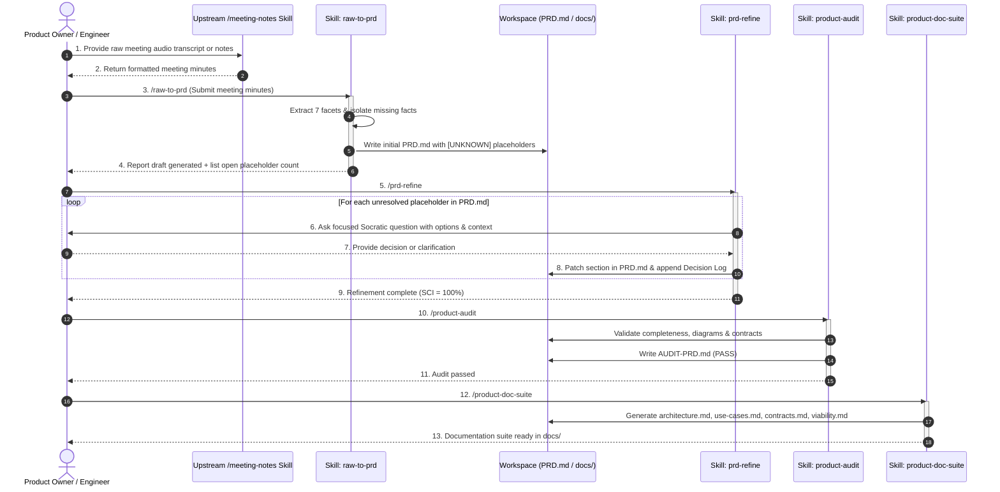

# System & User Interactions Specification

## 1. Interaction Model Overview

The **Product Owner Skill Suite** operates across three core interaction boundaries:
1. **Human-to-Agent Socratic Refinement**: An interactive, low-friction dialogue protocol designed to resolve ambiguities and make definitive architectural decisions one step at a time.
2. **Upstream System & Skill Ingestion**: Automated ingestion from raw transcripts, unstructured minutes, or structured output from skills like `/meeting-notes`.
3. **Downstream Agentic Handoff**: Clean transition of approved PRDs and documentation packs into execution workflows (e.g. `spec-driven-development`, `planning-and-task-breakdown`, and GSD coding subagents).

---

## 2. Interaction Diagrams

### 2.1 ASCII End-to-End Sequence Flow

```text
STAKEHOLDER              MEETING-NOTES SKILL       RAW-TO-PRD SKILL          PRD-REFINE SKILL        PRODUCT-DOC-SUITE
    |                           |                         |                         |                        |
    |-- 1. Raw Meeting Text --->|                         |                         |                        |
    |   or Audio Transcript     |                         |                         |                        |
    |<-- 2. Structured Notes -- |                         |                         |                        |
    |                                                     |                         |                        |
    |-- 3. /raw-to-prd (Pass Minutes/Notes) ------------->|                         |                        |
    |                                                     |-- Parse 7 Facets        |                        |
    |                                                     |-- Flag [UNKNOWN] tags   |                        |
    |                                                     |-- Render Mermaid flows  |                        |
    |                                                     |-- Write PRD.md -------->|                        |
    |<-- 4. Initial Draft Summary + Placeholder Count ----|                         |                        |
    |                                                                               |                        |
    |-- 5. /prd-refine ------------------------------------------------------------>|                        |
    |                                                                               |-- Read [UNKNOWN] tags  |
    |                                                                               |-- Prioritize Queue     |
    |                                                                               |                        |
    |   +======================== REFINEMENT LOOP (1 Question at a Time) ========================+    |
    |<--|-- 6. Ask Question 1: Context, Tradeoffs, Recommended Default --------------------------|---|    |
    |---|-- 7. Provide Answer / Select Option -------------------------------------------------->|---|    |
    |   |                                                                           |-- Patch PRD.md |    |
    |   |                                                                           |-- Add to Log   |    |
    |   +========================================================================================+    |
    |                                                                               |                        |
    |<-- 8. PRD Frozen (SCI = 100%, 0 Unknowns) ------------------------------------|                        |
    |                                                                                                        |
    |-- 9. /product-doc-suite ------------------------------------------------------------------------------>|
    |                                                                                                        |-- Generate SAD
    |                                                                                                        |-- Generate Contracts
    |                                                                                                        |-- Generate Use Cases
    |                                                                                                        |-- Generate Viability
    |<-- 10. Complete Documentation Pack Generated (docs/) --------------------------------------------------|
    v                                                                                                        v
```

### 2.2 Inline Mermaid End-to-End Interaction Sequence



*Standalone Diagram Sources:* 
- [interaction-sequence.mmd](file:///home/bill/src/ai/product-owner/docs/diagrams/interaction-sequence.mmd)
- [system-boundaries.mmd](file:///home/bill/src/ai/product-owner/docs/diagrams/system-boundaries.mmd)

---

## 3. Human-to-Agent Socratic Protocol

The refinement engine (`prd-refine`) enforces strict interactive constraints to minimize cognitive load on the stakeholder:

### Protocol Rules
1. **One Question at a Time**: The agent never dumps a list of 10 questions at once. It asks the single highest-impact question first.
2. **Context-Rich Framing**: Every question explicitly states *where* in the meeting this issue was mentioned and *why* it matters to the architecture.
3. **Structured Options with Defaults**: Provide 2 to 4 concrete technical/product options, with a marked `(Recommended)` default based on industry best practices.
4. **Immediate In-Place Persistence**: As soon as the user replies, the PRD is updated and the decision is recorded in the immutable Decision Log table.

### Socratic Prompt Example

```markdown
> [!IMPORTANT]
> **Decision Needed (1 of 4): Database Engine for Event Streaming**
> 
> **Context**: During the meeting, Sarah mentioned needing to buffer 50,000 webhook events/sec, but no specific message broker or persistence engine was finalized.
> **Impact**: Affects Section 5 (Architecture), Section 6 (Contracts), and downstream infrastructure sizing.
> 
> **Options**:
> 1. *(Recommended)* **Apache Kafka**: Best for high-throughput, replayable event streams and multi-consumer fanout.
> 2. **Redis Streams**: Lower operational complexity, suitable if retention window is < 24 hours.
> 3. **AWS SQS / SNS**: Fully managed serverless alternative, higher latency per message.
> 
> *Reply with your selection (1, 2, 3) or provide custom specifications.*
```

---

## 4. Multi-System Integration & Touchpoint Protocol

When mapping systems touched and interacted with, the PRD engine standardizes interactions across 4 system categories:

```text
+-------------------+---------------------------------------------------------+---------------------------------+
| System Category   | Integration Patterns Tracked                            | Required Specification In PRD   |
+-------------------+---------------------------------------------------------+---------------------------------+
| Data Stores       | ACID Transactions, Caching, Event Logs, Blob Storage    | Read/Write patterns, SLA, Auth  |
| Internal Services | Synchronous REST/gRPC, Asynchronous Pub/Sub, Webhooks   | Endpoints, Payloads, Latency    |
| Third-Party APIs  | Payment gateways, Auth providers (OAuth/OIDC), SMS/Email| API Quotas, Webhook retry rules |
| Infrastructure    | Cloud compute, CDN, Ingress Controllers, Secrets Store  | Environment constraints, VPC    |
+-------------------+---------------------------------------------------------+---------------------------------+
```

### System Interaction Contract Table Schema
Every system identified in raw minutes is tabulated in Section 5.2 of `PRD.md`:

| System Name | Category | Ownership | Interaction Protocol | Data Exchanged | Fallback / Circuit Breaker |
|---|---|---|---|---|---|
| `auth-service` | Internal Service | Core Team | gRPC / mTLS | JWT Tokens, User Permissions | Cached Token Validation |
| `stripe-api` | 3rd Party API | Stripe | REST HTTPS / Webhooks | Payment Intents, Customer IDs | Idempotent Retry with Exponential Backoff |
| `event-bus` | Data Bus | Platform Infra | Kafka / Avro | Telemetry & Audit Events | Local Disk Buffer |

---

## 5. Downstream Agentic Hand-Off

Once `PRD.md` passes the `product-audit` gate:
1. **`spec-driven-development`**: Consumes `PRD.md` to establish the Phase 0 capability map and module specifications (`SPEC-*.md`).
2. **`planning-and-task-breakdown`**: Consumes `docs/use-cases.md` and `docs/contracts.md` to construct dependency-ordered task trees (`tasks/todo.md` and `tasks/plan.md`).
3. **Engineering Subagents**: Utilize `docs/architecture.md` and `docs/contracts.md` as non-negotiable coding contracts.
