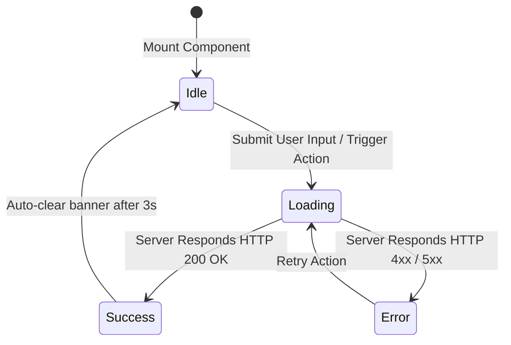

# Use Cases, UI/UX Wireframes & Capability Matrix

## 1. Actor Personas

| Actor | Description | Primary Goal in System |
|---|---|---|
| **Product Owner (PO)** | Business stakeholder or product manager with messy notes from customer or cross-functional meetings. | Transform meeting takeaways into a structured PRD and business viability model. |
| **Frontend Engineer / UX Designer** | Engineer building client interfaces, state transitions, and responsive forms. | Extract unambiguous screen layouts, field regexes, and component state machines. |
| **Engineering Lead / Architect** | Technical lead defining systems touched, tech stack, data contracts, and risks. | Verify technical viability, resolve architecture unknowns, ensure accurate diagrams. |
| **Antigravity Agent / Developer** | AI coding assistant executing implementation plans. | Consume unambiguous, fully specified contracts without guessing requirements. |

---

## 2. Capability Matrix

| Capability ID | Feature Name | Primary Skill | Inputs | Outputs |
|---|---|---|---|---|
| **CAP-01** | Raw Ingestion & Entity Parsing | `raw-to-prd` | Text notes, transcripts, audio minutes | Structured entity tree |
| **CAP-02** | 7-Facet PRD Synthesis | `raw-to-prd` | Structured entity tree | Baseline `PRD.md` |
| **CAP-03** | Unknowns & Gap Extraction | `raw-to-prd` | Extracted facts vs. 7-facet schema | Standardized `[UNKNOWN]` markers |
| **CAP-04** | Mermaid Diagram Generation | `raw-to-prd` | Identified entities & interactions | Topology & sequence diagrams |
| **CAP-05** | UI/UX Wireframe Synthesis | `raw-to-prd` | UI discussion notes & form fields | ASCII mockups & validation tables |
| **CAP-06** | SPIDR Vertical MVP Slicing | `product-doc-suite` | In-scope capabilities & architecture | 5-axis SPIDR breakdown |
| **CAP-07** | Socratic Refinement Engine | `prd-refine` | `PRD.md` with active placeholders | Interactive queries & updated PRD |
| **CAP-08** | Decision Audit Trail Logging | `prd-refine` | Resolved stakeholder answers | Append-only Decision Log |
| **CAP-09** | 7-Gate Quality Audit (SCI) | `product-audit` | Target `PRD.md` | Numerical SCI score (0-100%) |
| **CAP-10** | Multi-Doc Pack Derivation | `product-doc-suite` | Approved `PRD.md` | 4 modular docs in `docs/` |

---

## 3. UI/UX Interaction & Wireframe Specifications

### 3.1 Standard Terminal / Web Component Layout

```text
+===================================================================================================+
| [Header] Product Owner Suite: Active Specification Workspace                         [User: Lead] |
+===================================================================================================+
| (Sidebar Navigation)    | (Main Specification Workspace)                                          |
|                         |                                                                         |
| > Ingestion Dashboard   | +---------------------------------------------------------------------+ |
| > Active PRD.md         | | Ingestion Source: Q3_Strategy_Meeting_Transcript.txt                | |
| > Socratic Interview    | | Status: REFINING (SCI: 82%) | Open Unknowns: 3                      | |
| > Quality Gate Audit    | +---------------------------------------------------------------------+ |
| > Derived Docs (docs/)  |                                                                         |
|                         | [ Socratic Question Queue ]                                            |
|                         | 1. [ACTIVE] Database Engine for Event Streaming                        |
|                         |    Option A: Apache Kafka (Recommended)                                |
|                         |    Option B: Redis Streams                                             |
|                         |    Option C: AWS SQS / SNS                                             |
|                         |                                                                         |
|                         | [ Submit Decision ] [ Skip / Defer ]                                    |
+===================================================================================================+
```

### 3.2 Form & Field Validation Contract

| Field Name | Type | Validation Pattern | Required? | Client Error Message | Server Response Code |
|---|---|---|:---:|---|---|
| `specTitle` | Input Text | `^[A-Za-z0-9 _-]{3,64}$` | Yes | "Title must be 3-64 alphanumeric characters." | HTTP 400 `INVALID_TITLE` |
| `ownerEmail` | Input Email | `^[\w-\.]+@([\w-]+\.)+[\w-]{2,4}$` | Yes | "Please provide a valid corporate email address." | HTTP 400 `INVALID_EMAIL` |
| `targetSlaMs` | Number Int | `1 <= value <= 10000` | No | "Target SLA must be between 1ms and 10000ms." | HTTP 422 `UNPROCESSABLE_SLA` |

### 3.3 Component State Machine



---

## 4. SPIDR Vertical MVP Slicing Framework

```text
+---------------------------------------------------------------------------------------------------+
|                                      SPIDR DECOMPOSITION                                          |
+-------------------+---------------------------------------+---------------------------------------+
| Axis              | Phase 1: Minimal Viable Slice (MVP)   | Phase 2+: Incremental Hardening & Scale|
+-------------------+---------------------------------------+---------------------------------------+
| **Spike**         | Benchmark single-node parse speed     | Distributed multi-tenant bench        |
| **Paths**         | Happy path intake & Socratic loop     | Dead-letter queue & recovery paths    |
| **Interfaces**    | CLI commands & raw text file intake   | REST API & Webhook streaming endpoints|
| **Data**          | Flat JSON schemas & Markdown tables   | Complex nested schemas & binary files |
| **Rules**         | Basic type & non-null validations     | Dynamic RBAC & tenant quota validation|
+-------------------+---------------------------------------+---------------------------------------+
```

---

## 5. Detailed Use Case Specifications

### UC-01: Ingestion of Raw Meeting Minutes & Baseline PRD Synthesis
- **Primary Actor**: Product Owner / Technical Lead
- **Preconditions**: User has text minutes, bullet notes, or a transcript from a product meeting.
- **Trigger**: User invokes `/raw-to-prd` with input text.
- **Main Success Scenario**:
  1. The agent parses the text and segments it into raw facts across the 7 PRD facets.
  2. The agent identifies missing information (e.g. unspecified database, undefined error handling).
  3. The agent formats missing items into structured `[UNKNOWN: ...]` blocks.
  4. The agent writes `PRD.md` containing all knowns, placeholders, and Mermaid diagrams.
  5. The agent outputs a summary indicating the number of resolved vs. open placeholder items.

---

### UC-02: Zero-Hallucination Gap Analysis & Placeholder Registration
- **Primary Actor**: Engineering Lead / Architect
- **Preconditions**: Meeting notes omit critical technical details (e.g. auth protocol, latency SLAs).
- **Trigger**: System encounters an ungrounded requirement during synthesis.
- **Main Success Scenario**:
  1. System checks candidate fact against source text evidence.
  2. If evidence is absent, the system **does not invent** a solution (e.g., does not assume PostgreSQL or OAuth2).
  3. System constructs a standardized `[UNKNOWN: <Category>]` block containing source context, potential options, architectural impact, and a draft interview question.
  4. System registers the placeholder in Section 8 of `PRD.md`.

---

### UC-03: Socratic Refinement & Decision Logging
- **Primary Actor**: Product Owner / Technical Lead
- **Preconditions**: `PRD.md` exists with one or more open `[UNKNOWN]` or `[DECISION NEEDED]` markers.
- **Trigger**: User runs `/prd-refine`.
- **Main Success Scenario**:
  1. Refinement engine parses `PRD.md` and isolates the highest-priority unresolved placeholder.
  2. Agent presents the question to the user with background context and concrete options.
  3. User provides a response or selects an option.
  4. Agent replaces the placeholder in the appropriate PRD section with the concrete requirement.
  5. Agent adds a new row to Section 9 (*Decision Log & Audit Trail*) recording Date, Item, Prior State, Decision Made, and Author.
  6. Agent advances to the next placeholder or declares the PRD frozen if all are resolved.

---

### UC-04: Automated Quality Gate & Spec Completeness Audit
- **Primary Actor**: Engineering Lead / CI Agent
- **Preconditions**: User has completed Socratic refinement and wishes to freeze the PRD.
- **Trigger**: User runs `/product-audit`.
- **Main Success Scenario**:
  1. Auditor calculates Spec Completeness Index: $\text{SCI} = \left( 1 - \frac{W_{\text{req}} \cdot N_{\text{unknown}} + W_{\text{fork}} \cdot N_{\text{fork}}}{N_{\text{total\_dimensions}}} \right) \times 100\%$.
  2. Auditor verifies the 7 quality gates (Section completeness, Diagram parity, Contract pairing, NFR budgeting, RBAC security, SPIDR slicing, Zero fabrication).
  3. Auditor writes `AUDIT-PRD.md` with status `PASS` (if SCI $\ge$ 95% and 0 fatal errors) or `FAIL`.

---

### UC-05: Documentation Suite Derivation (`docs/`)
- **Primary Actor**: Antigravity Agent / Developer
- **Preconditions**: `PRD.md` has passed the `product-audit` gate.
- **Trigger**: User runs `/product-doc-suite`.
- **Main Success Scenario**:
  1. Engine reads the approved `PRD.md`.
  2. Engine generates `docs/architecture.md` (System Architecture Document / SAD with STRIDE).
  3. Engine generates `docs/use-cases.md` (Capability Matrix, Persona Stories, UI Wireframes, SPIDR Slicing).
  4. Engine generates `docs/contracts.md` (I/O Schemas, RBAC Tables, Feature Flag Configs).
  5. Engine generates `docs/viability.md` (Business Case, Latency SLOs, Zero-Downtime Rollout Runbook).
  6. Engine verifies cross-document consistency across all 4 files.
