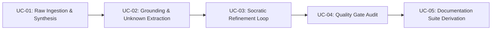

# Use Cases & Capability Matrix

## 1. Actor Personas

| Actor | Description | Primary Goal in System |
|---|---|---|
| **Product Owner (PO)** | Business stakeholder or product manager with messy notes from customer or cross-functional meetings. | Transform meeting takeaways into a structured PRD and business viability model. |
| **Engineering Lead / Architect** | Technical lead defining systems touched, tech stack, data contracts, and risks. | Verify technical viability, resolve architecture unknowns, ensure accurate diagrams. |
| **Antigravity Agent / Developer** | AI coding assistant executing implementation plans. | Consume unambiguous, fully specified contracts without guessing requirements. |

---

## 2. Capability Matrix

| Capability ID | Feature Name | Primary Skill | Inputs | Outputs |
|---|---|---|---|---|
| **CAP-01** | Raw Ingestion & Entity Parsing | `raw-to-prd` | Text notes, transcripts, audio minutes | Structured entity tree |
| **CAP-02** | 7-Facet PRD Synthesis | `raw-to-prd` | Structured entity tree | Baseline `PRD.md` |
| **CAP-03** | Unknowns & Gap Extraction | `raw-to-prd` | Extracted facts vs. 7-facet schema | Standardized `[UNKNOWN]` markers |
| **CAP-04** | Mermaid Diagram Generation | `raw-to-prd` | Identified entities & interactions | Topology & sequence diagrams |
| **CAP-05** | Socratic Refinement Engine | `prd-refine` | `PRD.md` with active placeholders | Interactive queries & updated PRD |
| **CAP-06** | Decision Audit Trail Logging | `prd-refine` | Resolved stakeholder answers | Append-only Decision Log |
| **CAP-07** | Spec Completeness Index (SCI) | `product-audit` | Target `PRD.md` | Numerical SCI score (0-100%) |
| **CAP-08** | Multi-Doc Pack Derivation | `product-doc-suite` | Approved `PRD.md` | 4 modular docs in `docs/` |

---

## 3. Detailed Use Case Specifications



### UC-01: Ingestion of Raw Meeting Minutes & Baseline PRD Synthesis
- **Primary Actor**: Product Owner / Technical Lead
- **Preconditions**: User has text minutes, bullet notes, or a transcript from a product meeting.
- **Trigger**: User invokes `/raw-to-prd` with input text.
- **Main Success Scenario**:
  1. The agent parses the text and segments it into raw facts across the 7 PRD facets.
  2. The agent identifies missing information (e.g. unspecified database, undefined error handling).
  3. The agent formats missing items into structured `[UNKNOWN: ...]` blocks.
  4. The agent writes `PRD.md` containing all knowns, placeholders, and Mermaid diagrams.
  5. The agent outputs a summary indicating the number of resolved vs. open placeholder items.

#### Gherkin Acceptance Scenario
```gherkin
Scenario: Ingesting unstructured meeting notes
  Given the user provides 20 lines of unstructured meeting minutes
  When the user executes "/raw-to-prd"
  Then "PRD.md" is created in the repository root
  And Section 1 through Section 7 are populated with extracted facts
  And any unstated technical parameters are marked with "[UNKNOWN: ...]"
  And Section 5 contains a valid Mermaid architecture diagram
  And Section 8 contains the active placeholder registry
```

---

### UC-02: Zero-Hallucination Gap Analysis & Placeholder Registration
- **Primary Actor**: Engineering Lead / Architect
- **Preconditions**: Meeting notes omit critical technical details (e.g. auth protocol, latency SLAs).
- **Trigger**: System encounters an ungrounded requirement during synthesis.
- **Main Success Scenario**:
  1. System checks candidate fact against source text evidence.
  2. If evidence is absent, the system **does not invent** a solution (e.g., does not assume PostgreSQL or OAuth2).
  3. System constructs a standardized `[UNKNOWN: <Category>]` block containing source context, potential options, architectural impact, and a draft interview question.
  4. System registers the placeholder in Section 8 of `PRD.md`.

#### Gherkin Acceptance Scenario
```gherkin
Scenario: Handling missing architectural details
  Given the meeting notes mention "we need a fast caching layer" without naming a technology
  When the synthesis engine processes Section 5 (Architecture)
  Then the engine must NOT unilaterally choose Redis or Memcached
  And the engine must emit a "[UNKNOWN: ARCHITECTURE - Caching Engine]" placeholder
  And the placeholder must list Redis, Memcached, and In-Memory as candidate options
```

---

### UC-03: Socratic Refinement & Decision Logging
- **Primary Actor**: Product Owner / Technical Lead
- **Preconditions**: `PRD.md` exists with one or more open `[UNKNOWN]` or `[DECISION NEEDED]` markers.
- **Trigger**: User runs `/prd-refine`.
- **Main Success Scenario**:
  1. Refinement engine parses `PRD.md` and isolates the highest-priority unresolved placeholder.
  2. Agent presents the question to the user with background context and concrete options.
  3. User provides a response or selects an option.
  4. Agent replaces the placeholder in the appropriate PRD section with the concrete requirement.
  5. Agent adds a new row to Section 9 (*Decision Log & Audit Trail*) recording Date, Item, Prior State, Decision Made, and Author.
  6. Agent advances to the next placeholder or declares the PRD frozen if all are resolved.

#### Gherkin Acceptance Scenario
```gherkin
Scenario: Resolving an unknown item via Socratic interview
  Given "PRD.md" has an open placeholder "[UNKNOWN: DATA_SCHEMA - User ID Format]"
  When the user runs "/prd-refine"
  Then the agent asks the user to choose between UUIDv4, ULID, or Integer Auto-increment
  When the user replies "UUIDv4"
  Then the placeholder is replaced with "UUIDv4" in Section 6
  And a row is appended to the Decision Log in Section 9
  And the placeholder is removed from Section 8
```

---

### UC-04: Automated Quality Gate & Spec Completeness Audit
- **Primary Actor**: Engineering Lead / CI Agent
- **Preconditions**: User has completed Socratic refinement and wishes to freeze the PRD.
- **Trigger**: User runs `/product-audit`.
- **Main Success Scenario**:
  1. Auditor calculates Spec Completeness Index: $\text{SCI} = \frac{\text{Completed Sections}}{\text{Total Sections}} \times 100\%$.
  2. Auditor verifies that all systems named in Section 5.2 exist in the Section 5.1 Mermaid diagram.
  3. Auditor confirms that all API inputs in Section 6.1 have matching error/output models in Section 6.2.
  4. Auditor writes `AUDIT-PRD.md` with status `PASS` (if SCI $\ge$ 95% and 0 fatal errors) or `FAIL`.

#### Gherkin Acceptance Scenario
```gherkin
Scenario: Auditing a fully refined PRD
  Given "PRD.md" has 0 open "[UNKNOWN]" placeholders
  And all systems in Section 5.2 are represented in Mermaid diagrams
  When the user executes "/product-audit"
  Then "AUDIT-PRD.md" is generated
  And the audit report status is "PASS"
  And the Spec Completeness Index is reported as 100%
```

---

### UC-05: Documentation Suite Derivation (`docs/`)
- **Primary Actor**: Antigravity Agent / Developer
- **Preconditions**: `PRD.md` has passed the `product-audit` gate.
- **Trigger**: User runs `/product-doc-suite`.
- **Main Success Scenario**:
  1. Engine reads the approved `PRD.md`.
  2. Engine generates `docs/architecture.md` (System Architecture Document / SAD).
  3. Engine generates `docs/use-cases.md` (Capability Matrix & User Stories).
  4. Engine generates `docs/contracts.md` (I/O Schemas & Interface Specifications).
  5. Engine generates `docs/viability.md` (Business Case & Risk Scorecard).
  6. Engine verifies cross-document consistency across all 4 files.

#### Gherkin Acceptance Scenario
```gherkin
Scenario: Deriving complete product documentation pack
  Given "PRD.md" has an approved audit status of "PASS"
  When the user executes "/product-doc-suite"
  Then the "docs/" directory contains "architecture.md", "use-cases.md", "contracts.md", and "viability.md"
  And all schemas in "contracts.md" match the contracts in "PRD.md"
  And all diagrams in "architecture.md" render without syntax errors
```
