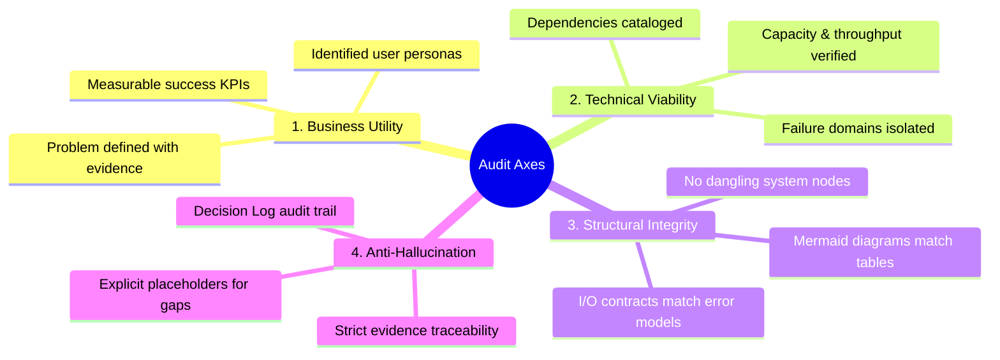

# Viability, Business Value & Quality Audit Framework

## 1. Overview & Evaluation Dimensions

The **Product Owner Skill Suite** embeds a rigorous evaluation framework to ensure that every PRD and generated documentation suite is:
1. **Commercially Viable**: Delivers positive ROI, clear business value, and strategic alignment.
2. **Technically Feasible**: Built on proven architectures with identified dependency boundaries.
3. **Spec-Complete**: Validated against the mathematical **Spec Completeness Index (SCI)** before engineering begins.

---

## 2. Spec Completeness Index (SCI)

The **Spec Completeness Index (SCI)** provides a quantitative score of how close a specification is to being fully grounded and actionable.

### 2.1 Mathematical Formulation

$$\text{SCI} = \left( 1 - \frac{W_{\text{req}} \cdot N_{\text{unknown}} + W_{\text{fork}} \cdot N_{\text{fork}}}{N_{\text{total\_dimensions}}} \right) \times 100\%$$

Where:
- $N_{\text{unknown}}$ = Number of active `[UNKNOWN: ...]` placeholders.
- $N_{\text{fork}}$ = Number of unresolved `[DECISION NEEDED: FORK]` conflicts.
- $W_{\text{req}}$ = Weight factor for functional/technical unknowns ($1.0$).
- $W_{\text{fork}}$ = Weight factor for architectural decision forks ($1.5$).
- $N_{\text{total\_dimensions}}$ = Total evaluation points (Baseline = $20$).

### 2.2 Quality Thresholds

| SCI Range | State | Status & Allowed Next Steps |
|---|---|---|
| **0% - 59%** | `DRAFT` | Blocked. Requires intensive Socratic refinement (`/prd-refine`). |
| **60% - 89%** | `IN_REVIEW` | Warning. Core architecture identified, but specific schemas or edge cases remain open. |
| **90% - 99%** | `NEAR_COMPLETE` | Conditional approval. Minor edge cases open; core build order can be planned. |
| **100%** | `FROZEN / READY` | Full PASS. Approved for `product-doc-suite` and execution by engineering agents. |

---

## 3. The 5-Axis Quality Audit Rubric

```text
+---------------------------------------------------------------------------------------------------+
|                                  THE 5-AXIS AUDIT RUBRIC                                          |
+-------------------+-------------------------------------------------------------------------------+
| Axis              | Verification Checks & Invariants                                              |
+-------------------+-------------------------------------------------------------------------------+
| 1. Utility        | Clear problem statement; explicit personas; delta over current workarounds.  |
| 2. Viability      | Proven tech choices; dependency risks documented; fallback strategies defined.|
| 3. Completeness   | All 7 core facets specified; 0 ungrounded assumptions; schemas defined.       |
| 4. Integrity      | Mermaid diagrams match text systems 1:1; input contracts have output schemas. |
| 5. Grounding      | Zero hallucination; every requirement traces to raw minutes or Decision Log.  |
+-------------------+-------------------------------------------------------------------------------+
```

### 3.1 Detailed Rubric Checklist



---

## 4. Business Value & ROI Scoring Framework

To evaluate whether a product initiative should proceed from PRD to development, each PRD evaluates 3 financial and operational pillars:

### Pillar 1: Operational Efficiency & Time Saved
- **Formula**: $\text{Annual Hours Saved} = (\text{Time Per Task}_{\text{old}} - \text{Time Per Task}_{\text{new}}) \times \text{Annual Frequency}$
- **Value**: $\text{Cost Savings} = \text{Annual Hours Saved} \times \text{Blended Hourly Rate}$

### Pillar 2: Revenue Uplift & Conversion
- Projected increase in customer acquisition, reduction in churn, or expansion revenue enabled by the feature.

### Pillar 3: Risk Reduction & Compliance Protection
- Cost of non-compliance, regulatory penalties avoided, or security vulnerability remediation.

---

## 5. Audit Gate Verdict Decision Table

When `product-audit` runs against `PRD.md`, it outputs an official quality gate verdict in `AUDIT-PRD.md`:

| Verdict | Trigger Conditions | Recommended Action |
|---|---|---|
| `PASS` | SCI $\ge 95\%$, 0 fatal errors, all diagrams match text systems. | Proceed immediately to `product-doc-suite` and engineering plan. |
| `WARNING` | SCI between $80\%$ and $94\%$, non-critical edge cases open. | Review warnings; user may override or trigger `/prd-refine`. |
| `FAIL` | SCI $< 80\%$, ungrounded hallucinations found, or missing core schemas. | Block all downstream code generation. Route back to `/prd-refine`. |
