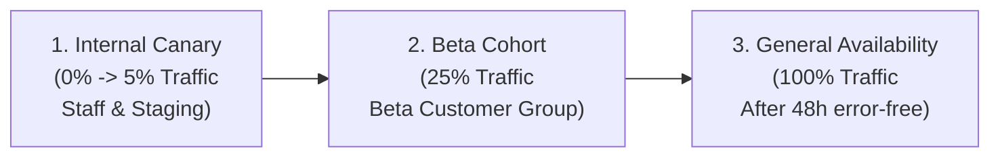

# Viability, NFRs, Business Value & Safe Rollout Framework

## 1. Overview & Evaluation Dimensions

The **Product Owner Skill Suite** embeds a rigorous evaluation framework to ensure that every PRD and generated documentation suite is:
1. **Commercially Viable**: Delivers positive ROI, clear business value, and strategic alignment.
2. **Technically Feasible**: Built on proven architectures with identified dependency boundaries.
3. **Spec-Complete & NFR-Grounded**: Validated against latency SLO budgets and the **Spec Completeness Index (SCI)** before engineering begins.
4. **Operationally Safe**: Equipped with a zero-downtime rollout runbook and automated rollback triggers.

---

## 2. Quantitative NFR & Latency SLO/SLA Budgeting

Every product specification must define concrete non-functional criteria to prevent ungrounded infrastructure sizing:

```text
+-------------------+-----------------------+-----------------------+-----------------------+-------------------------+
| NFR Dimension     | Target SLO            | SLA Breach Limit      | Telemetry Source      | Remediation on Breach   |
+-------------------+-----------------------+-----------------------+-----------------------+-------------------------+
| **p95 Latency**   | <= 200 ms             | > 500 ms              | APM / Prometheus      | Auto-scale pod replicas |
| **p99 Latency**   | <= 400 ms             | > 1000 ms             | APM / Prometheus      | Circuit-breaker trip    |
| **Throughput**    | 1,000 req/sec         | < 200 req/sec         | Gateway telemetry     | Rate-limit non-essential|
| **Availability**  | 99.95% monthly uptime | < 99.9% monthly uptime| Synthetic health ping | Failover to backup AZ   |
| **Disaster Rec**  | RTO < 15m / RPO < 1m  | RTO > 1h / RPO > 15m  | Snapshot replication  | Emergency restore plan  |
+-------------------+-----------------------+-----------------------+-----------------------+-------------------------+
```

---

## 3. Zero-Downtime Rollout & Feature Flagging Runbook

To ensure reliable, non-disruptive deployments, specifications mandate a 3-tier rollout process:

### 3.1 Rollout Phasing



### 3.2 Feature Flag Configuration Contract
- **Flag Key**: `feat_[initiative_name]`
- **Default State**: `false`
- **Evaluation Engine**: LaunchDarkly / Unleash / OpenFeature
- **Targeting Rules**: Cohort tenant IDs $\rightarrow$ Percentage rollout $\rightarrow$ Fallback default.

### 3.3 Automated Rollback Triggers & Circuit Breakers
- **Trigger 1 (Error Spike)**: 5xx HTTP error rate $\ge 1.0\%$ sustained over 3 consecutive minutes $\rightarrow$ Automated flag disablement to `false`.
- **Trigger 2 (Latency Degradation)**: p95 latency $> 500\text{ ms}$ for 5 minutes $\rightarrow$ Traffic routed to legacy fallback endpoint.
- **Trigger 3 (Data Inconsistency)**: Checksum mismatch on shadow dual-writes $\rightarrow$ Pause backfill worker.

---

## 4. Spec Completeness Index (SCI)

The **Spec Completeness Index (SCI)** provides a quantitative score of how close a specification is to being fully grounded and actionable.

### 4.1 Mathematical Formulation

$$\text{SCI} = \left( 1 - \frac{W_{\text{req}} \cdot N_{\text{unknown}} + W_{\text{fork}} \cdot N_{\text{fork}}}{N_{\text{total\_dimensions}}} \right) \times 100\%$$

Where:
- $N_{\text{unknown}}$ = Number of active `[UNKNOWN: ...]` placeholders.
- $N_{\text{fork}}$ = Number of unresolved `[DECISION NEEDED: FORK]` conflicts.
- $W_{\text{req}} = 1.0$ (weight factor for functional/technical unknowns).
- $W_{\text{fork}} = 1.5$ (weight factor for architectural decision forks).
- $N_{\text{total\_dimensions}} = 25$ (evaluation points across all 7 facets).

### 4.2 Quality Thresholds

| SCI Range | State | Status & Allowed Next Steps |
|---|---|---|
| **0% - 59%** | `DRAFT` | Blocked. Requires intensive Socratic refinement (`/prd-refine`). |
| **60% - 89%** | `IN_REVIEW` | Warning. Core architecture identified, but specific schemas or edge cases remain open. |
| **90% - 99%** | `NEAR_COMPLETE` | Conditional approval. Minor edge cases open; core build order can be planned. |
| **100%** | `FROZEN / READY` | Full PASS. Approved for `product-doc-suite` and execution by engineering agents. |

---

## 5. The 7-Gate Quality Audit Rubric

```text
+---------------------------------------------------------------------------------------------------+
|                                  THE 7-GATE AUDIT RUBRIC                                          |
+-------------------+-------------------------------------------------------------------------------+
| Gate              | Verification Checks & Invariants                                              |
+-------------------+-------------------------------------------------------------------------------+
| 1. Completeness   | All 9 PRD sections present; core problem & personas defined.                  |
| 2. Diagram Parity | Mermaid diagrams match Section 5.2 systems and Section 4 use cases 1:1.       |
| 3. Contract Pair  | Every input contract in Section 6.1 has a paired output/error model in 6.2.   |
| 4. NFR Budgeting  | Concrete p95/p99 latency, throughput, and availability metrics defined.       |
| 5. Threat/RBAC    | STRIDE mitigations and role-based capability matrices specified.              |
| 6. SPIDR Slicing  | MVP decomposed across Spike, Paths, Interfaces, Data, Rules + Rollout runbook.|
| 7. Zero-Fabricate | Zero ungrounded hallucinations; all items trace to notes or Decision Log.     |
+-------------------+-------------------------------------------------------------------------------+
```

---

## 6. Business Value & ROI Scoring Framework

### Pillar 1: Operational Efficiency & Time Saved
- **Formula**: $\text{Annual Hours Saved} = (\text{Time Per Task}_{\text{old}} - \text{Time Per Task}_{\text{new}}) \times \text{Annual Frequency}$
- **Value**: $\text{Cost Savings} = \text{Annual Hours Saved} \times \text{Blended Hourly Rate}$

### Pillar 2: Revenue Uplift & Conversion
- Projected increase in customer acquisition, reduction in churn, or expansion revenue enabled by the feature.

### Pillar 3: Risk Reduction & Compliance Protection
- Cost of non-compliance, regulatory penalties avoided, or security vulnerability remediation.
