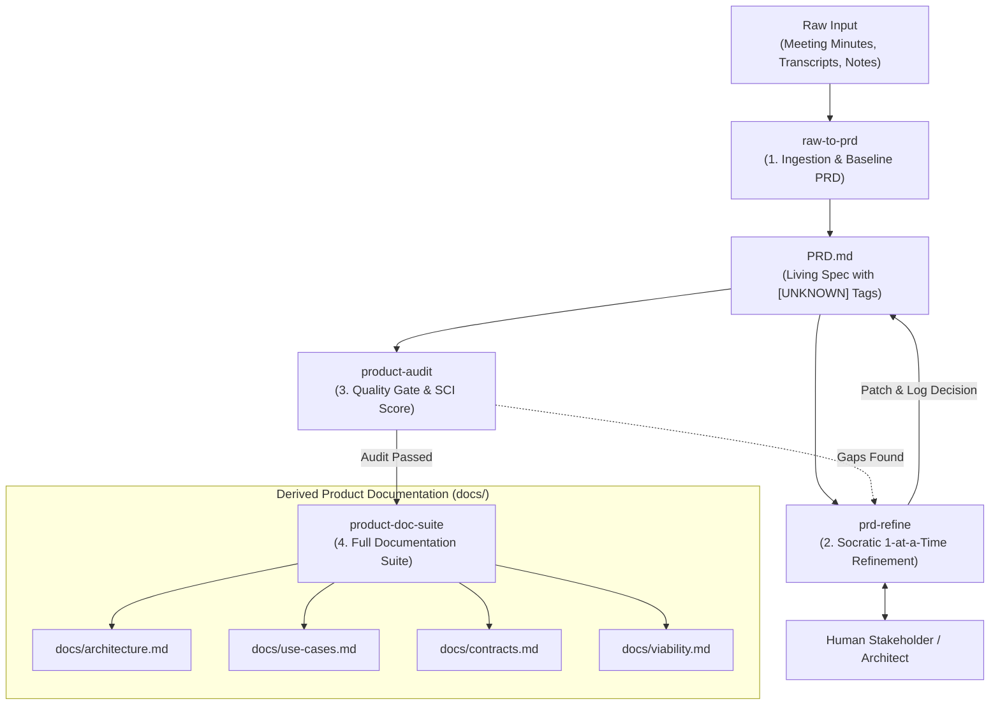

# Product Owner (Umbrella Meta-Skill)

## Overview

The `product-owner` meta-skill acts as the central router and orchestrator for turning raw, unstructured product inputs (meeting minutes, stakeholder transcripts, brainstorm notes) into a complete, grounded, production-grade product specification and documentation suite.

## The Product Owner Pipeline

---

## Sub-Skill Delegation Routing

When handling product owner workflows, delegate to the specialized sub-skills based on the user's intent or current document state:

| Intent / State | Command / Action | Delegate To |
|---|---|---|
| Ingest meeting minutes, notes, transcripts, or audio notes | `/raw-to-prd` | `skills/raw-to-prd` |
| Resolve open `[UNKNOWN]` placeholders via interactive interview | `/prd-refine` | `skills/prd-refine` |
| Validate completeness, calculate SCI, and audit quality | `/product-audit` | `skills/product-audit` |
| Generate complete `docs/` pack from approved `PRD.md` | `/product-doc-suite` | `skills/product-doc-suite` |

---

## Core Invariants

1. **Zero Unverified Invention**: When raw input lacks specific technical details (auth providers, DB engines, latency SLAs), NEVER guess. Always flag with `[UNKNOWN: ...]` or `[DECISION NEEDED: ...]`.
2. **Atomic Socratic Interviews**: Refine open questions one at a time with clear context, options, and recommended defaults.
3. **Immutable Audit Trail**: Every resolved decision must be recorded in Section 9 (*Decision Log & Audit Trail*) of `PRD.md`.
4. **Single Source of Truth**: All auxiliary documentation in `docs/` must strictly derive from `PRD.md` without divergence.

---

## Command Shortcuts

- `/product-owner [input]` — Runs end-to-end pipeline (ingest → check completeness → prompt next step).
- `/raw-to-prd [input]` — Synthesizes baseline `PRD.md` from input text.
- `/prd-refine` — Starts interactive Socratic question loop on open placeholders in `PRD.md`.
- `/product-audit` — Runs quality audit, computes SCI, and generates `AUDIT-PRD.md`.
- `/product-doc-suite` — Derives SAD, Use Cases, Contracts, and Viability docs into `docs/`.
